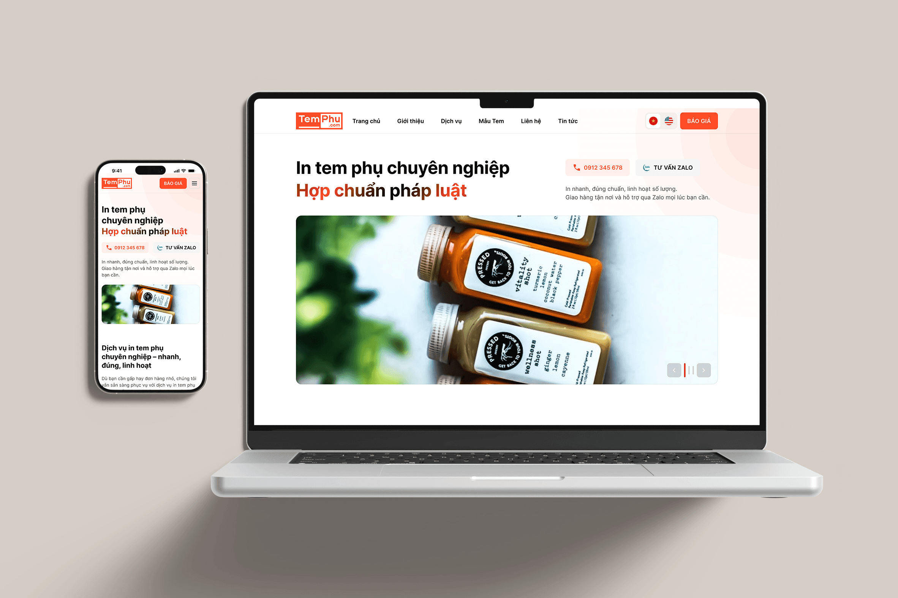
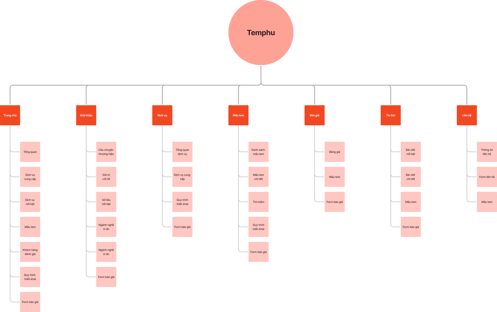
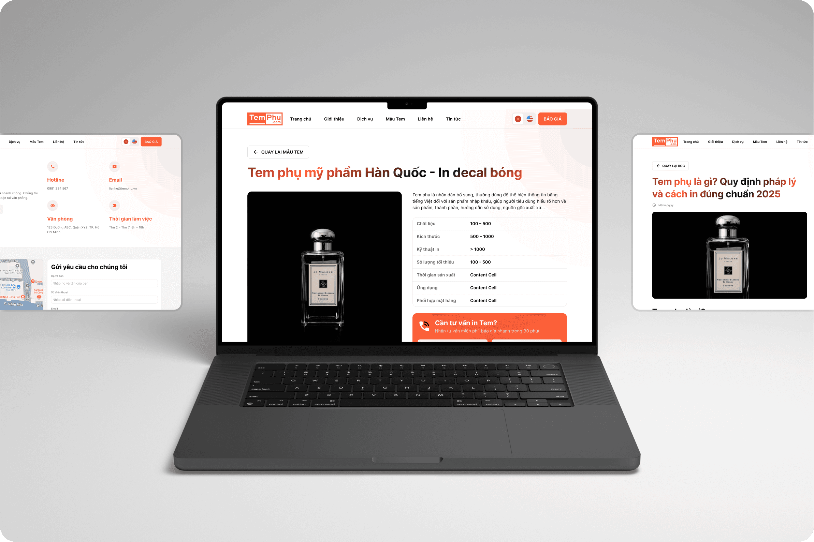
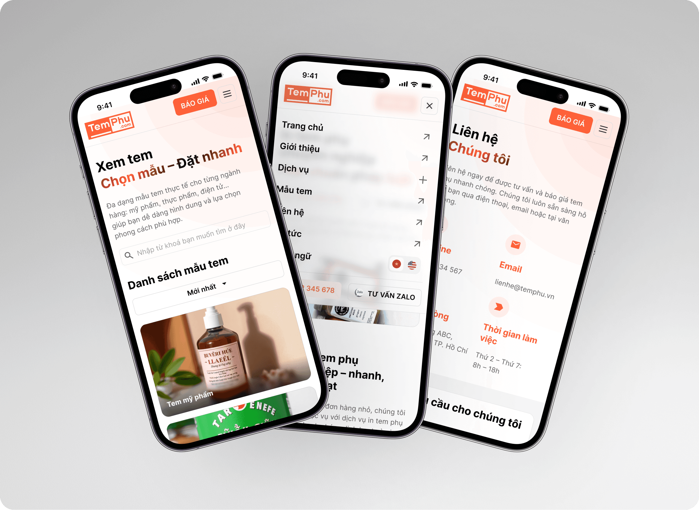
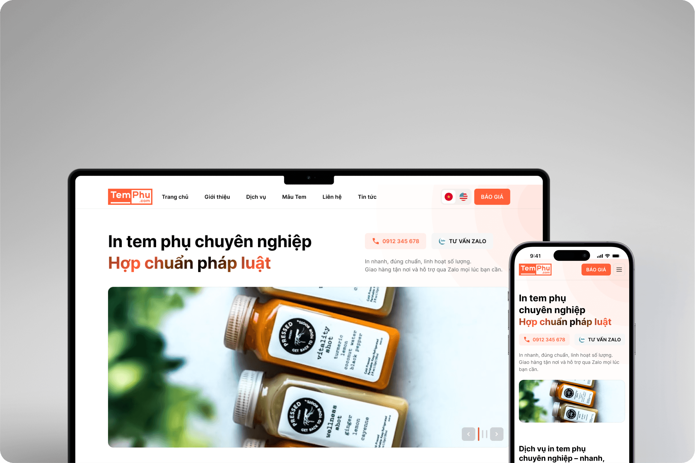

# Temphu

## Project Overview

- **Project name:** Temphu
- **Product type:** Marketing website
- **Client / Company:** Ichiban Việt Nam
- **Timeline:** 1 months
- **Size team:** 4 members (2 UXUI & 2 Developers)
- **My role:** UXUI Lead

### Project Objective

- Establish a strong online presence for Ichiban's printing stamp services
- Drive leads and conversions through clear CTAs and optimized landing sections
- Streamline service browsing and quotation request workflows

## Team & Responsibilities

### UXUI team member

- Me - UX/UI Lead, responsible for experience direction, system design, and flow mapping
- Member 2 – Junior Designer, assisted with UI screens and component consistency

### Your Responsibilities

- Led research and user needs analysis
- Collaborated with BA, Dev, PO
- Created IA, wireframes, and user flows
- Built and managed the design system
- Reviewed and provided feedback on junior designer's work
- Conducted UI QA before handoff to development

## Problem Statement

- Existing website was outdated and lacked mobile responsiveness, affecting user engagement.
- The business required a modern digital interface to support customer interaction and online inquiries.
- Customers faced challenges in tracking orders and managing invoices with Ichiban.
- A large and diverse product catalog made it hard for users to find the right printing solutions.
- The ordering process was overly complex, involving multiple manual steps (quotation, approval, inventory handling).
- There was no tailored user experience for different client types, such as wholesalers, retailers, or internal staff.

## Goals & KPIs

### Business Goals

Given that the client lacked a modern digital presence for their printing stamp services, our UX/UI team contributed to achieving the following business goals:

- **Increase customer inquiries** by designing clear navigation, service highlights, and effective call-to-action placement.
- **Improve conversion rates** by simplifying the quote request process and making pricing more transparent and accessible.
- **Enhance brand credibility** through a visually appealing, modern interface that reflects professionalism and service quality.
- **Support digital transformation** by moving traditional sales materials and forms to a centralized, online platform.
- **Bridge user needs & business offerings** by creating clear content flows for different service types and customer use cases (e.g., barcode labels, QR code stamps, custom branding).
- **Enable internal marketing and sales efficiency** by providing editable content blocks and lead tracking integrations (e.g., CRM, form submissions).

### UX/UI KPIs

As the UX/UI Lead, I was responsible for defining and achieving the following key objectives:

- Design a responsive, mobile-first website that clearly communicates the range of stamp printing services.
- Create a smooth quotation flow that minimizes user friction while collecting all necessary order details (e.g., quantity, size, material, file upload).
- Address previous website issues such as outdated layouts, unclear CTAs, and inconsistent branding.
- Build a flexible component system for future scalability—covering service pages, quote forms, testimonials, FAQs, and blog/news sections.
- Tailor the experience to multiple buyer personas: corporate clients, retailers, logistics providers, and internal stakeholders.

## Implementation Process

In this project, my team used the **Design Sprint** approach to solve the UIUX related problems we encountered.

## Sitemap & IA

Below is a website built by Lucidchart and presented the website decentralization system.

## Design System

- The design system of project is built based on **Ant Design System** and **Atomic design**.
- We define the brand font and colors first, then we start to separate the element and build the atom of the elements.

Here are a couple of components we defined in the **design system version 1.0.**

## UI Design

- **UI style:** The style of project is based on a **minimalism** and **material design**.

Here are a couple of screens from the Marketing website project.

