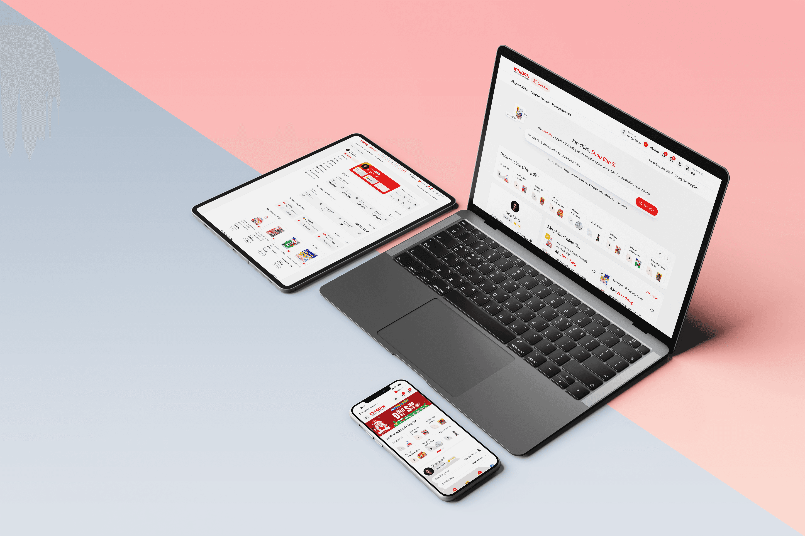

# Ichiban

## Project Overview

- **Project name:** Ichiban Việt Nam
- **Product type:** B2B eCommerce Platform
- **Client / Company:** Ichiban Việt Nam
- **Timeline:** 3.5 months
- **Size team:** 6 members
- **My role:** UXUI Leader (team of 2)

### Project Objective

- Create a new eCommerce platform for a wholesale business
- Optimize complex ordering workflows and user roles
- Improve experience for buyers, sellers, and internal admins

## Team & Responsibilities

### UXUI team members

- Me - UX/UI Lead, responsible for experience direction, system design, and flow mapping
- Member 2 – Junior Designer, assisted with UI screens and component consistency

### Your Responsibilities

- Led research and user needs analysis
- Collaborated with BA, Dev, PO
- Created IA, wireframes, and user flows
- Built and managed the design system
- Reviewed and provided feedback on junior designer's work
- Conducted UI QA before handoff to development

## Problem Statement

- Outdated system with poor mobile usability
- Digital transformation using customer-facing software
- Customers find it difficult to manage receivables with Ichiban
- Complex product catalog made search difficult
- Ordering required multiple steps: quotation, approval, inventory note
- Lack of personalized experience for different buyer segments

## Goals & KPIs

### Business Goals

Given that the legacy platform was inefficient and difficult to scale, the UX/UI team was tasked with contributing to the following goals:

- **Increase the order completion rate** by streamlining the purchase journey and simplifying the quotation logic.
- **Reduce cart abandonment** by making the checkout process faster and more intuitive, with clear and transparent pricing.
- **Improve operational efficiency** by reducing the need for manual support through a clean and user-friendly interface.
- **Support digital transformation**: Modernize the company's order infrastructure to enable long-term scalability and integrations (ERP, CRM, etc.).
- **Bridge user needs & business logic**: Create flows that respect complex B2B workflows (e.g. multi-tier pricing, approval chains) while remaining intuitive.
- **Enable internal team efficiency**: Reduce friction for internal sales/admin teams, who also rely on the system daily.

### UX/UI KPIs

As the UX/UI Leader, my responsibility was to define and uphold the following key objectives:

- Design an adaptable experience for **multiple B2B user personas**: wholesale buyers, resellers, internal sales reps, and accountants.
- Address **critical pain points from the legacy system**: non-responsive layout, excessive steps, unclear pricing, and product selection errors.
- Build a **scalable design system** that supports reusable components across modules (cart, quotation, approval, delivery slips, etc.).

## Implementation Process

In this B2B eCommerce project, I adopted the **Double Diamond model** as a strategic framework to guide the entire design process. This approach allowed our UX/UI team to move through a structured path of **divergent and convergent thinking**—from discovering real user needs to delivering validated solutions—ensuring every design decision was grounded in user insight and aligned with business goals.

During the **Discover** phase, we focused on understanding the purchasing behaviors of target users such as convenience store owners and small supermarkets through **desk research**, **interviews**, and **competitor analysis**. We then entered the **Define** phase to synthesize insights into clear user personas, journey maps, and key problem statements.

In the **Ideate** stage, we conducted design workshops, sketched concepts, and mapped flows for critical business processes like quotation, approval, and credit-based purchasing. Finally, in the **Deliver** phase, we built interactive prototypes, conducted usability testing, iterated based on feedback, and collaborated closely with the development team to ensure seamless implementation.

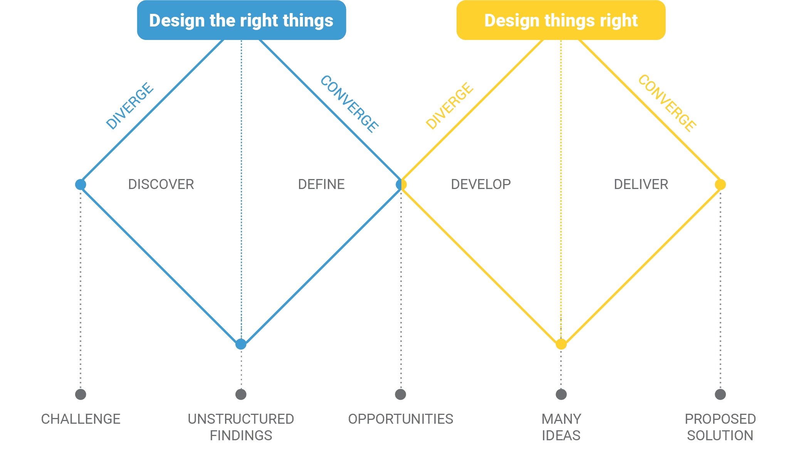

## Research

Before starting this project, my group had to study a lot of things related to wholesale like specialized term, implementation process, debt,… By the way, I have to divide my team to promote the search process faster. And here are 3 stacks that my group has been made.

### Competitor Analysis

- SWOT Analysis
- Feature Matrix
- Outcome: In the market research in Vietnam on B2B Ecommerce platforms, after using the secondary research method (Research), my group has things and we think this is my opposition to our products.

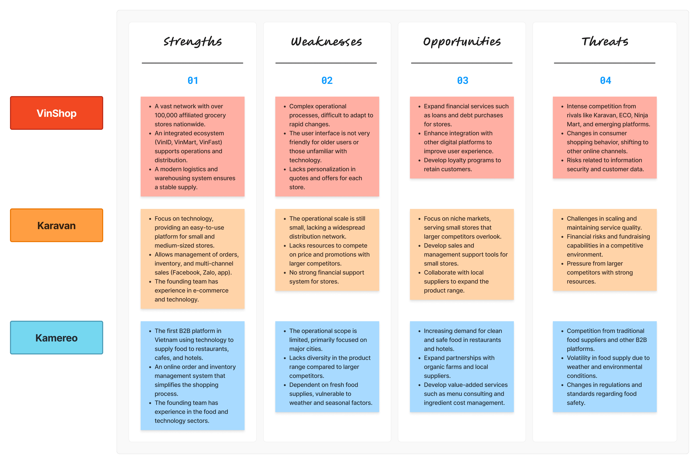

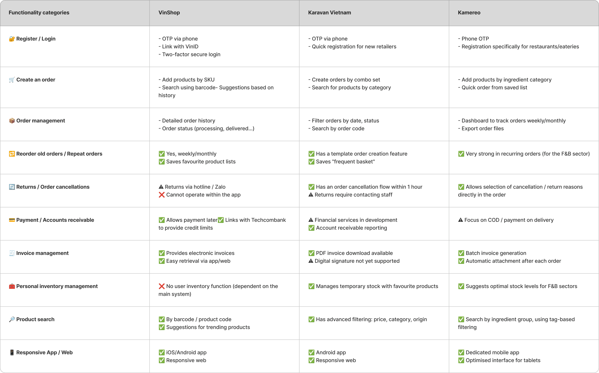

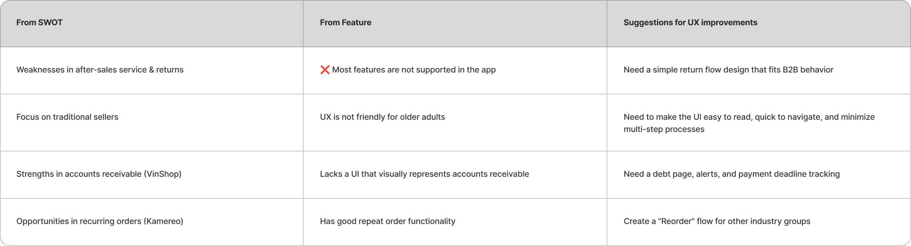

### Stakeholder interview

For the interview of the parties involved, I took on the role of contact with BOD, PO, Sale Manager,… of the company to collect data from them.

- Business Model Canvas (BMC)
- Value Proposition Canvas (VPC)
- Outcome

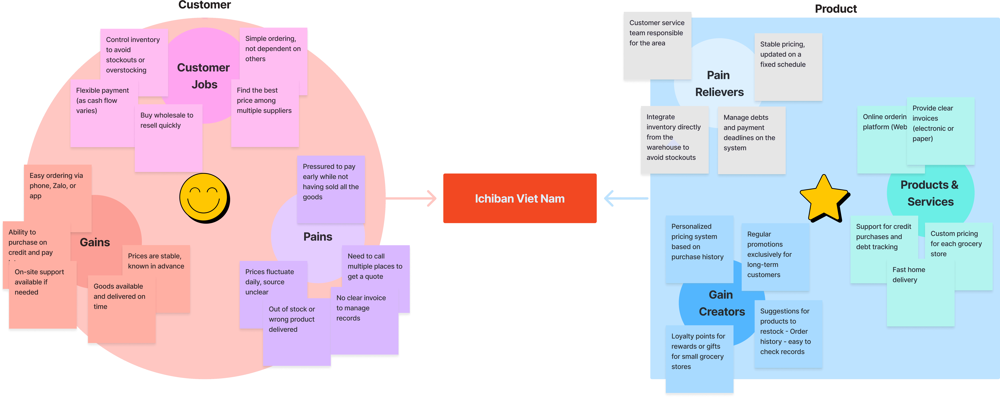

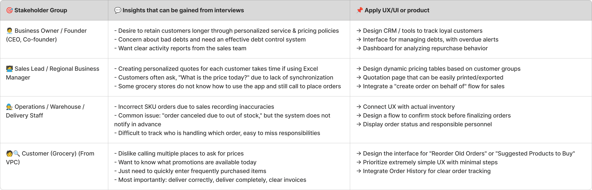

### User research

- User Persona
- Empathy Map
- Journey Map
- Outcome

## Information Architect & Flow

### Sitemap

Below is a website built by Lucidchart and presented the website decentralization system.

### User flow

In the project, my group had to build a lot of diagrams for users. Here are a typical diagram that my team has made.

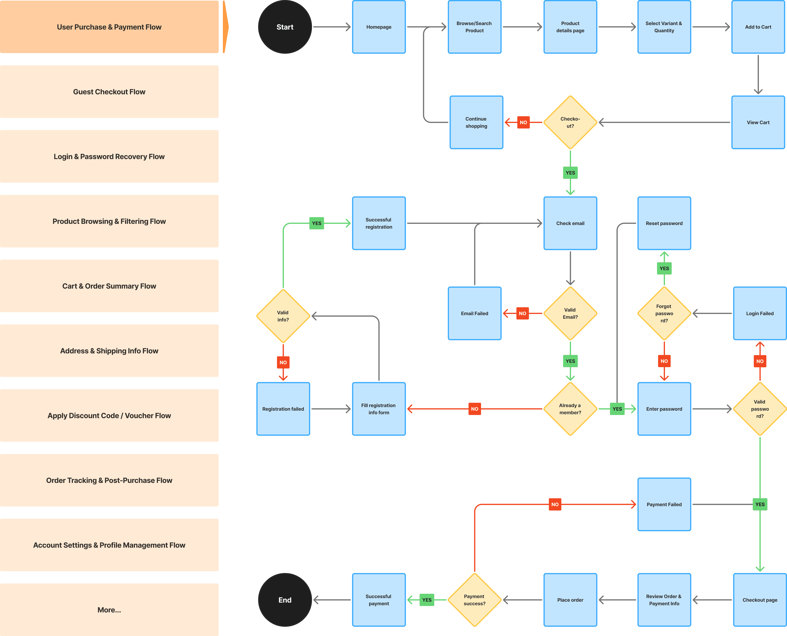

## Wireframes

- Desktop
- Mobile

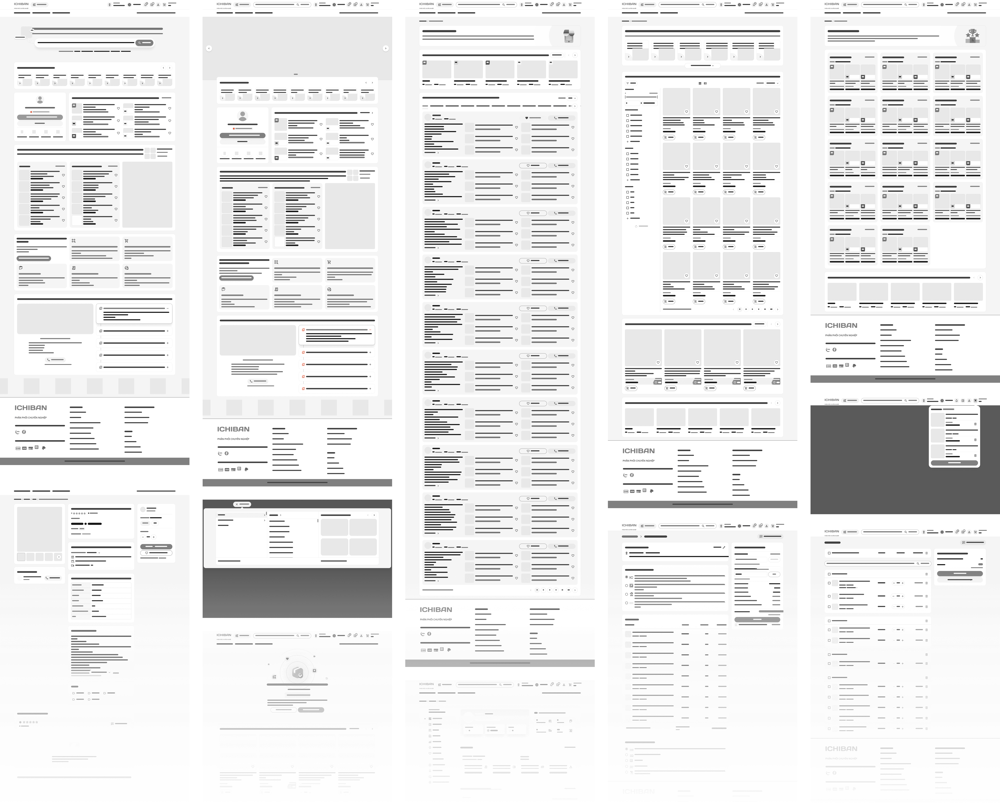

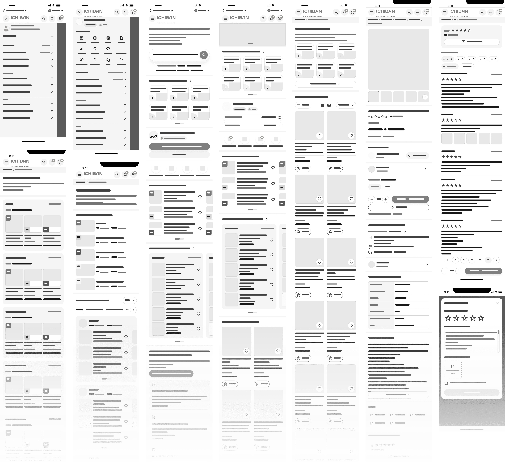

## Design System & UI Design

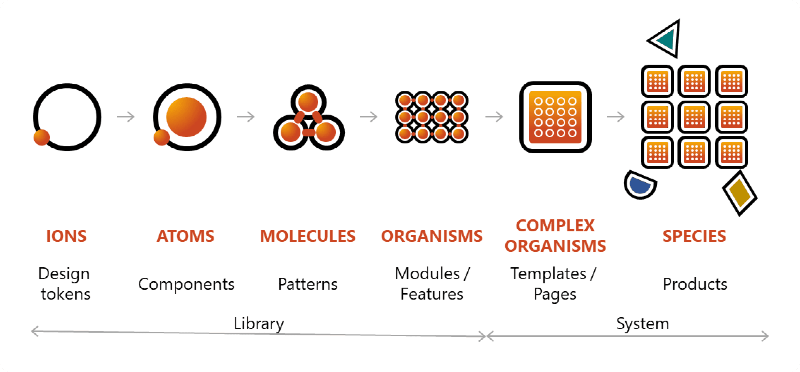

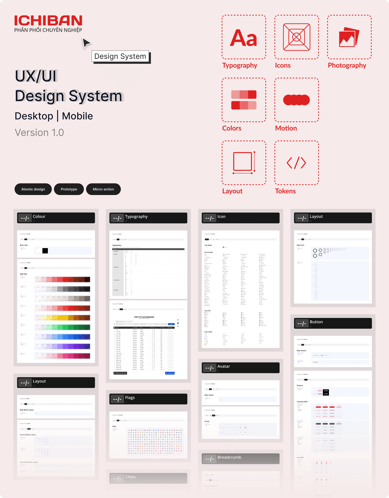

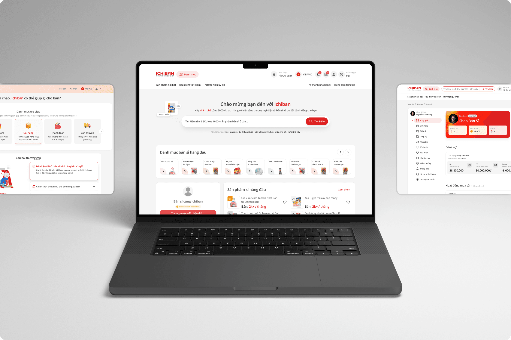

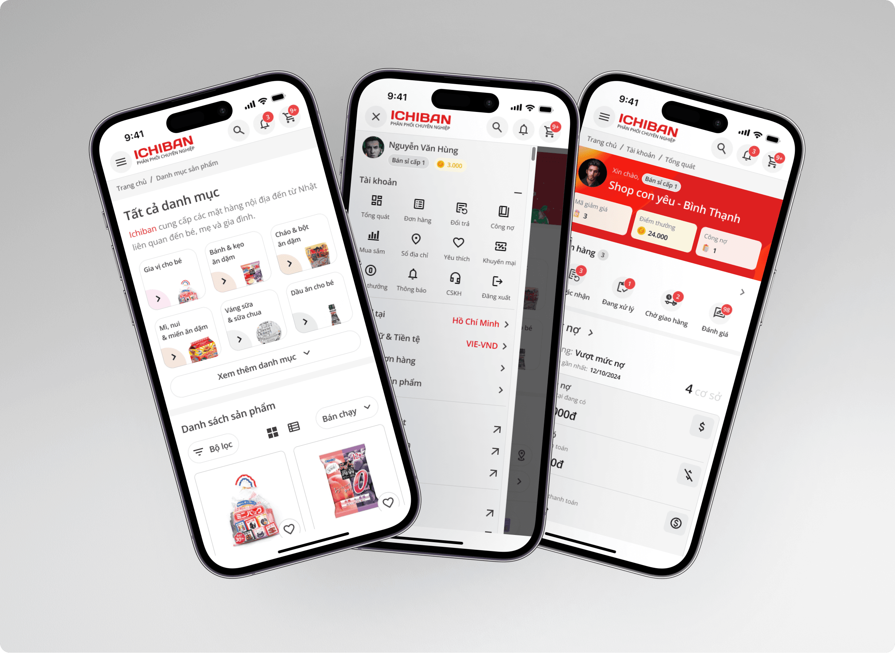

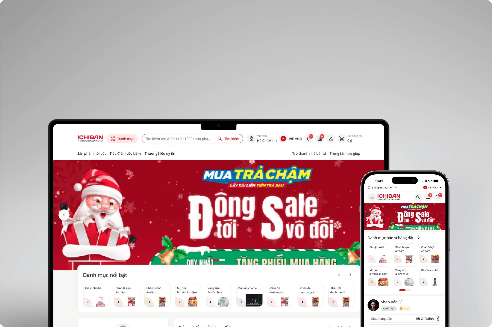

### Design System

To ensure consistency, flexibility, and scalability across the product, the **Ichiban Vietnam** project has adopted the **Atomic Design** methodology in building its **Design System**. By breaking down the user interface into hierarchical components — _atoms_, _molecules_, _organisms_, _templates_, and _pages_ — the design team can effectively manage each element, from a single button to an entire page layout.

### UI Design

## Iteration & Validation

## Outcome & Impact

## Lessons Learned
