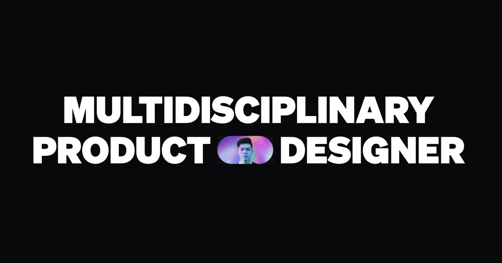
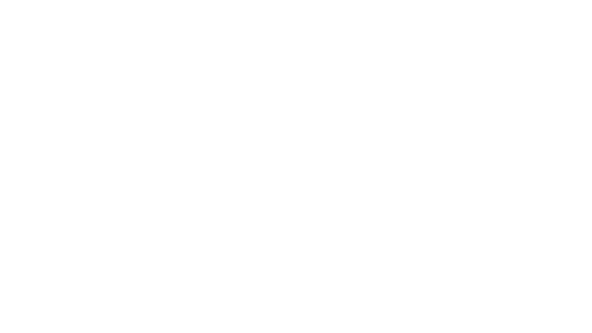
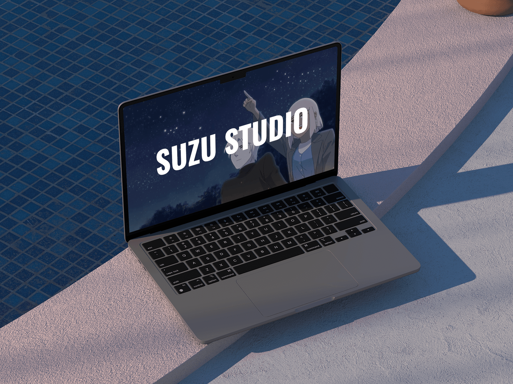

# SuZu Studio

## Project Overview

SuZu Studio is a subsidiary of SuZu Group, specializing in a diverse range of industries related to community, animation, and comics.

With a focus on fostering community engagement and creating captivating content in the realms of animation and comics, SuZu Studio plays a vital role in extending the reach and impact of the larger SuZu Group across various creative and interactive domains.

## Goal Statement

- **Our** SuZu Studio **Will let users** to find and view our projects easily.
- **Which will affect** how users know about their services and the projects they have done with clients.
- **By** giving them a general project page and accompanying services for that project.
- **Will measure effectiveness by** user contact and visit times.

## Work Progress

- Short-term project about 1.5 months to build and develop.
- My position at the project is Project Manager and works with a UX/UI designer.
- Work with CEO to discuss, define and document product requirements for features available on the site.
- Identify problems, ideal solutions for products according to CEO requirements.
- Design UXUI website quickly to be on the market soon.

## Design Process

In this project, my team used the **Design Sprint 2.0** approach to solve the UIUX related problems we encountered.

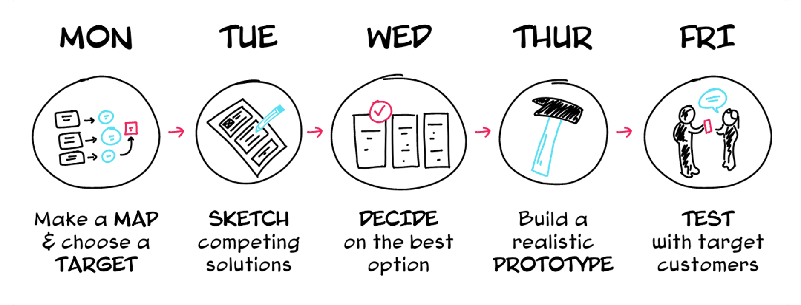

## User Persona(s)

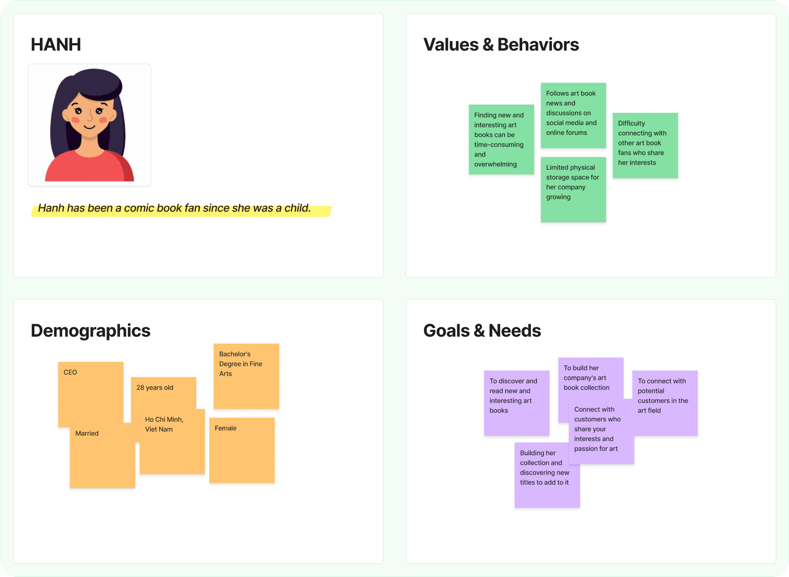

## Problem Statement

- **Our** SuZu Studio **Will let users** to find and view our projects easily.
- **Which will affect** how users know about their services and the projects they have done with clients.
- **By** giving them a general project page and accompanying services for that project.
- **Will measure effectiveness by** user contact and visit times.

## Empathy Mapping

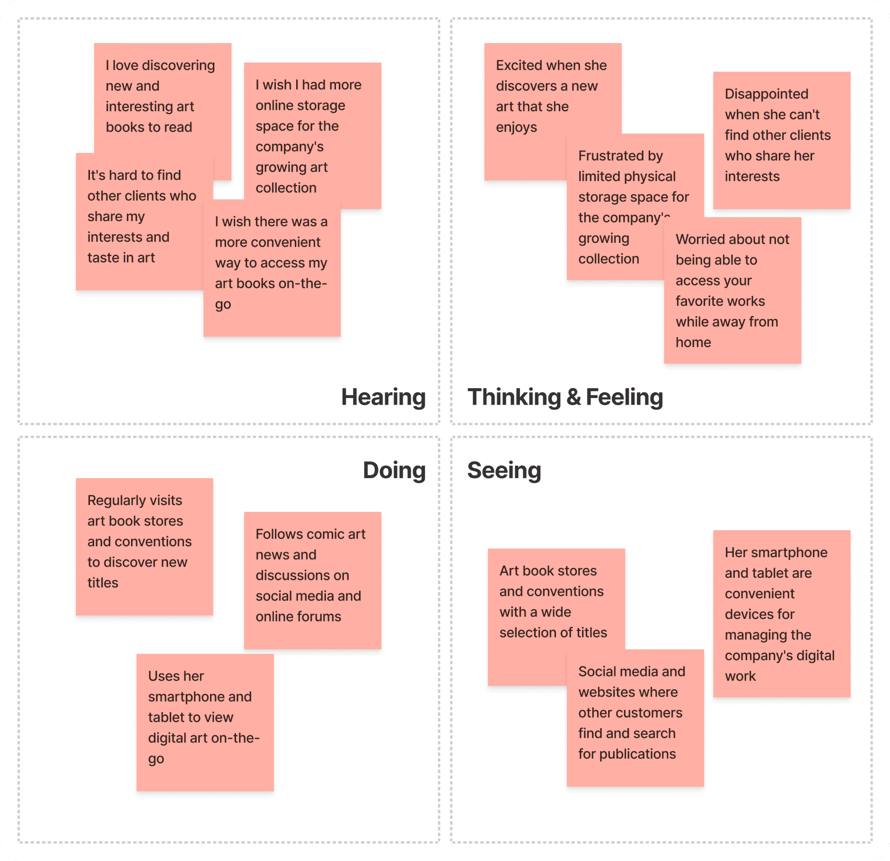

## User Stories & Acceptance Criteria

Here is an example story and acceptance criteria.

### Story

- **As an** client.
- **I want** to see the all of projects and services.
- **So that** i can distinguish products from other places.

### Acceptance criteria

- **Given** the project card on site.
- **When** user see product project & category.
- **Then** users will then know about the services in the project deployed to customers.

## Sitemap & IA

Below is a sitemap list of the pages of a website within a domain.

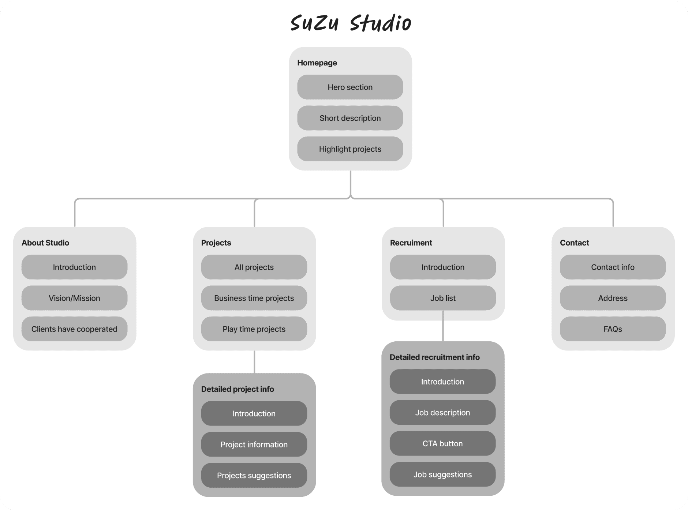

## User Flow

Below is an example of user flow when it comes to user experience on a website.

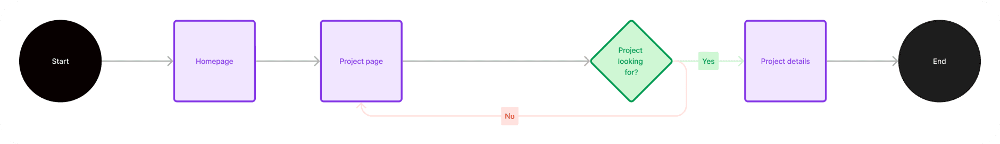

## Design Sprint

First, during Sprint design, we must determine the goal of the problem to be solved.

We've had a lot of brainstorming sessions while working together, and the session below is a typical brainstorming session in our design & development workflow when building a project.

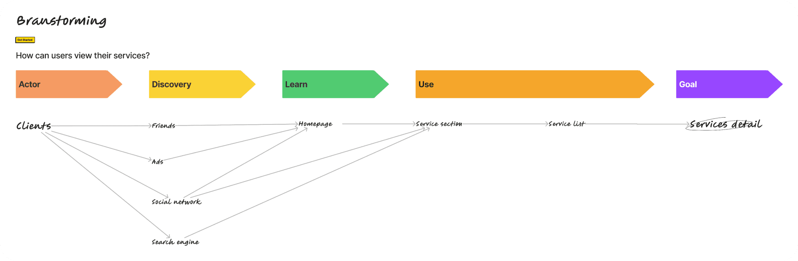

### Map to map

- **Actor(s):** clients.
- **Goal:** service details.

## Design System

- The design system of project is built based on **Ant Design System** and **Atomic design**.
- We just defined the brand font and colors first, then we start to separate the element and build the atom of the elements.

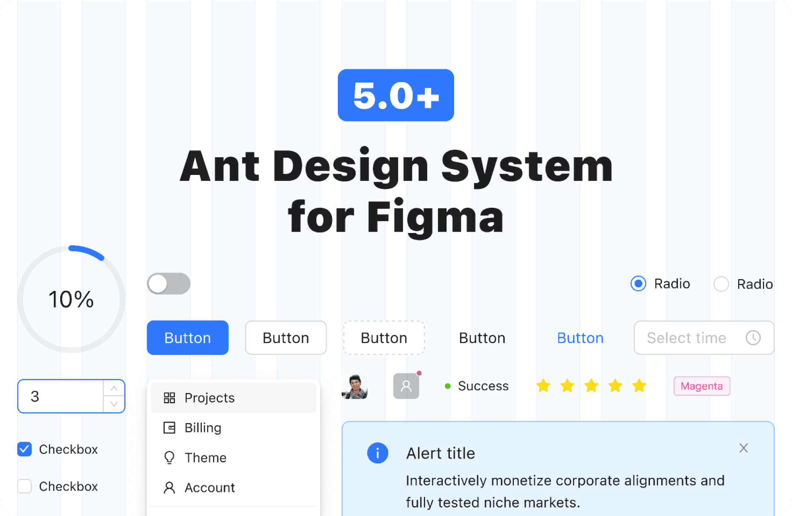

## UI Design

- **UI style:** The style of project is based on a **minimalism**.

Here are a couple of screens from the e-commerce project.

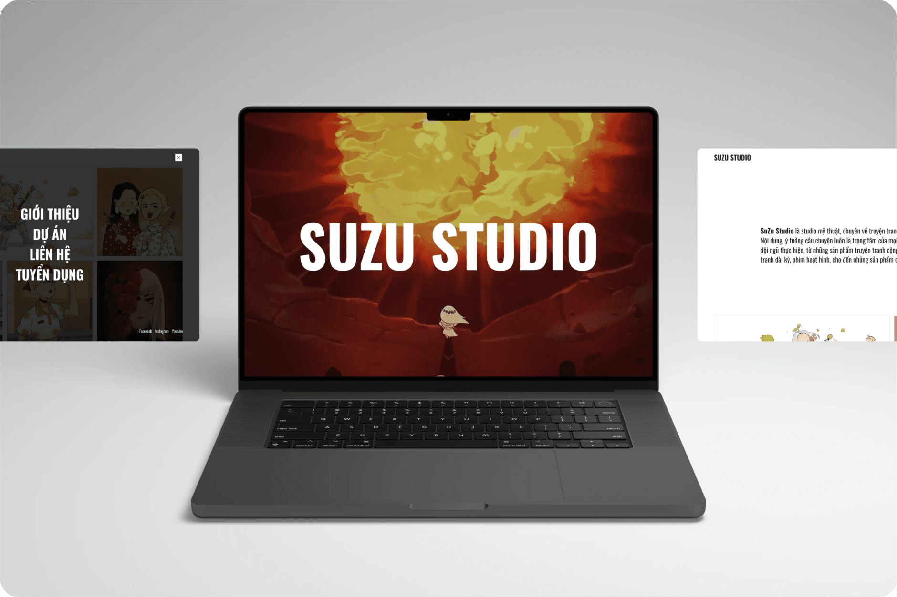

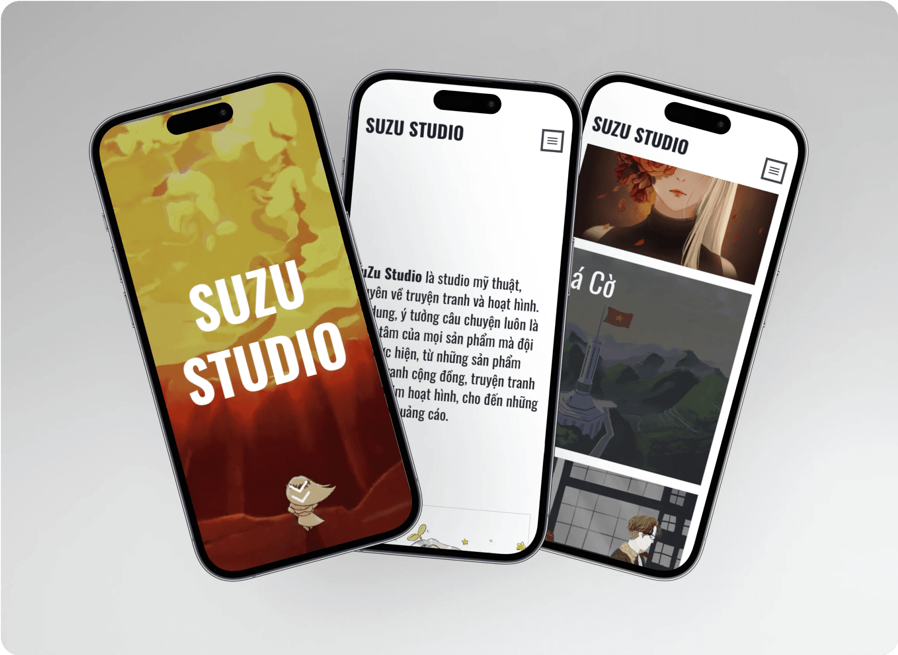

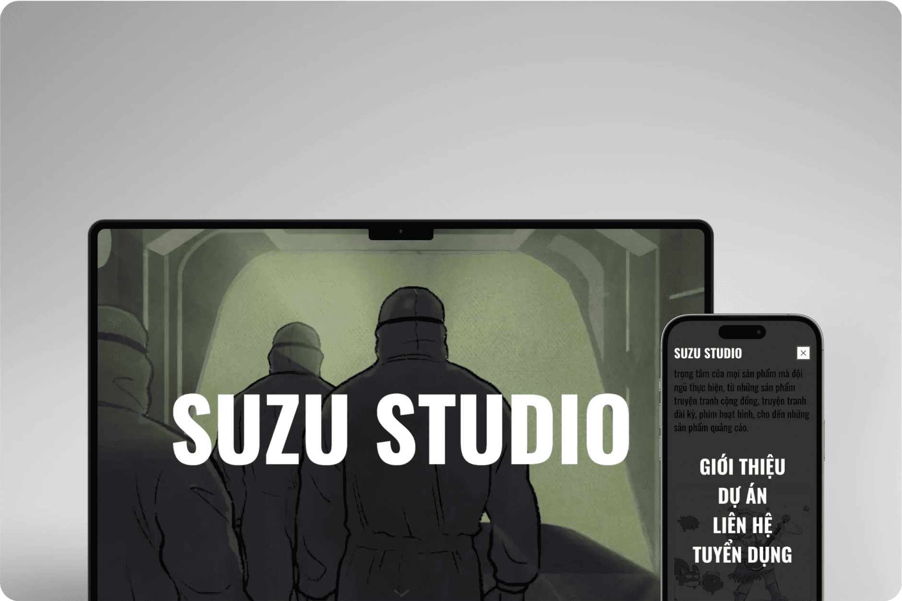
