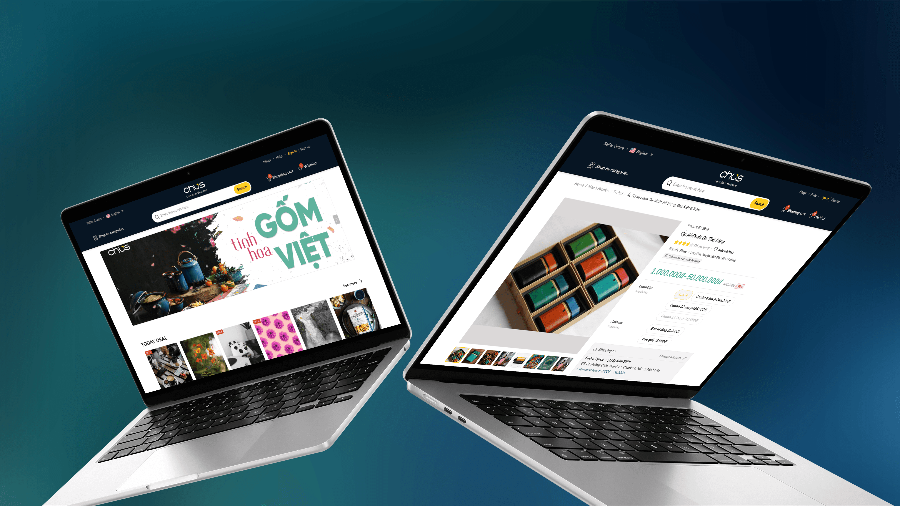
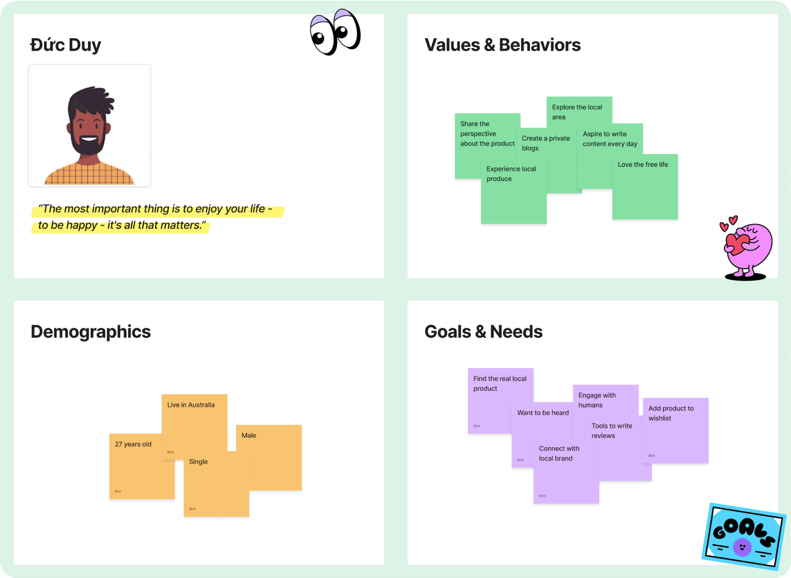
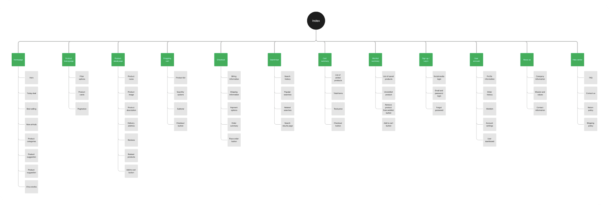
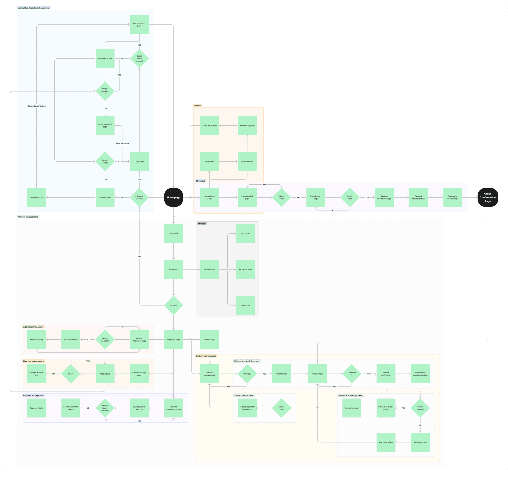
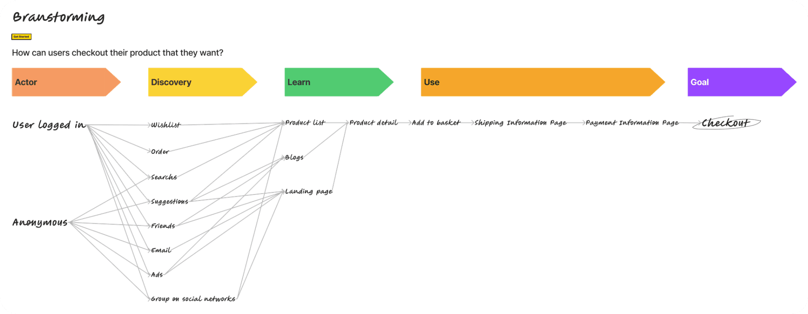
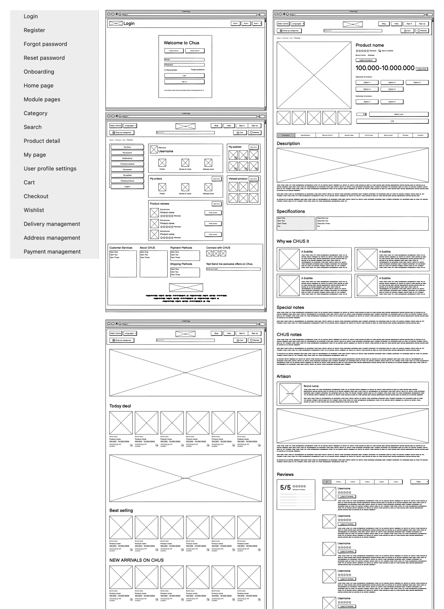
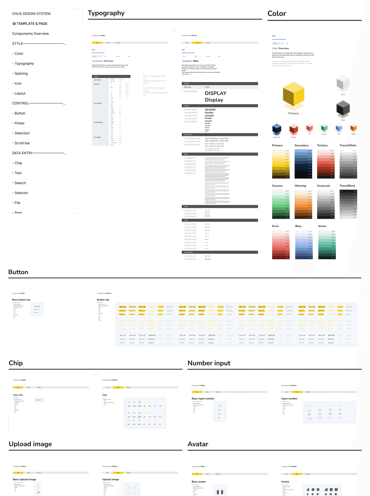
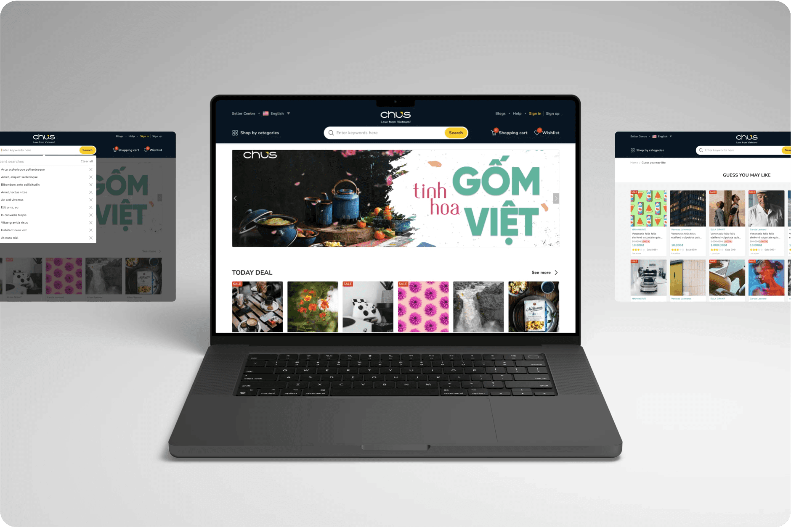
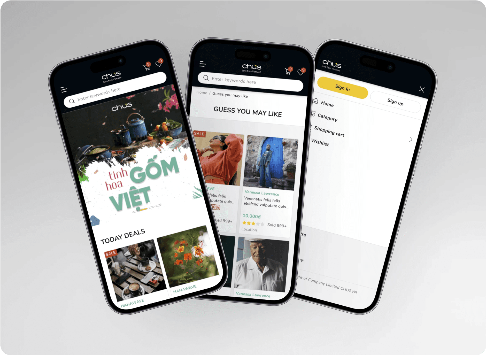
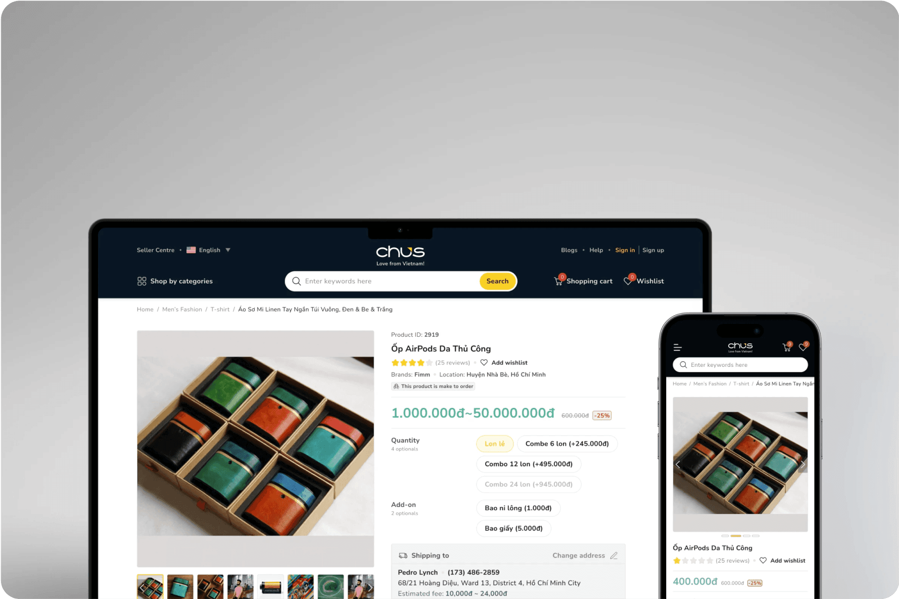

# Chus

## Project Overview

CHUS is platform developed by team technical of Dosiin Group. They want to create an e-commerce site that introduces customers to Vietnamese handicraft products. Provide a playground for artists and art-loving customers.

Design User-friendly e-commerce website design that is user-centered to deploy flows as well as features suitable to needs.

## Goal Statement

- **Our** Chus (E-commerce market) **Will let users** to find items from local brands more easily.
- **Which will affect** how users connect with local brands.
- **By** giving them to ability to connect with local brands in their countries.
- **Will measure effectiveness by** user searches on the internet.

## Work Progress

- Long-term e-commerce project takes about 6 months to build and develop for phase 1.
- My position at the company is UX/UI-Leader and with 1 partner.
- Work with stakeholders (POs) to discuss, define and document product requirements for features available on the site.
- Identify problems, ideal solutions for products according to customer requirements.
- Write product related documents such as MVPs, PRDs, Cucumber, etc.
- Design new UI and UX flows for end users with new features and upgrade old that is suitable for today's market.

## Design Process

In this project, my team used the **Design Sprint 2.0** approach to solve the UIUX related problems we encountered.

## Competitor Analysis

## User Persona(s)

At this phase, we only focus on 2 user groups and here is an example.

## Empathy Mapping

## User Story & Acceptance Criteria

First of all, when I start creating a user story, I have to determine the goal or purpose the user hopes for and the features or functionality that can bring their hope. Then I write their expectations and acceptance criteria when they use or experience these features or functions.

I used **Cucumber** method (this method can assist tester on user flow and validation) to write and define the user story & acceptance criteria.

Here is a example of user story.

### Story 1

- **As an** customer.
- **I want** to see the address of the manufactured products.
- **So that** i can distinguish products from other places.

#### Acceptance criteria

- **Given** the product card on site.
- **When** i see label on the product card.
- **Then** i will know where to provide that products.

### Story 2

- **As an** customer.
- **I want** to see the rating from another user.
- **So that** users knows which products are of top interest.

#### Acceptance criteria

- **Given** product card on site.
- **When** icon rating on the product card.
- **Then** user can clearly identify the top product in the market.

## Sitemap

Below is a map list of the pages of a website within a domain.

## Flowchart

Below is a description of the user flow as the user experiences on the website.

## Design Sprint

First, during Sprint design, we must determine the goal of the problem to be solved.

We've had a lot of brainstorming sessions while working together, and the session below is a typical brainstorming session in our design & development workflow when building a project.

### Map to map

- **Actor(s):** logged in and anonymous users.
- **Goal:** checkout.

### LofI Wireframe

And once we've all learned about the user's goals and problems, complete research and testing steps like Competitive Analysis, Persona(s), Empathy Map, and Etc. We brainstorm and sketch each person's ideas.

Here are a couple of examples of our wireframe screens in this project after we discussed and agreed on the idea we chose.

## Design System

During the wireframe drawing process, we start to build the design system for this project.

- The design system of project is built based on **Material Design 3 (Google)** and **Atomic design**.
- We define the brand font and colors first, then we start to separate the element and build the atom of the elements.

Here are a couple of components we defined in the **design system version 1.0.**

## UI Design

- **UI style:** The style of project is based on a **minimalism** and **material design**.

Here are a couple of screens from the e-commerce project.

