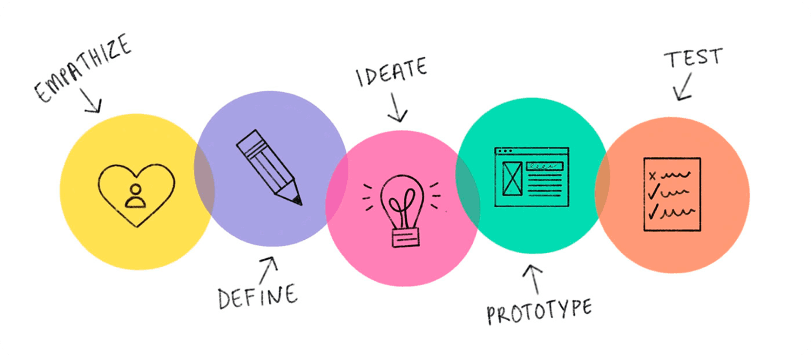
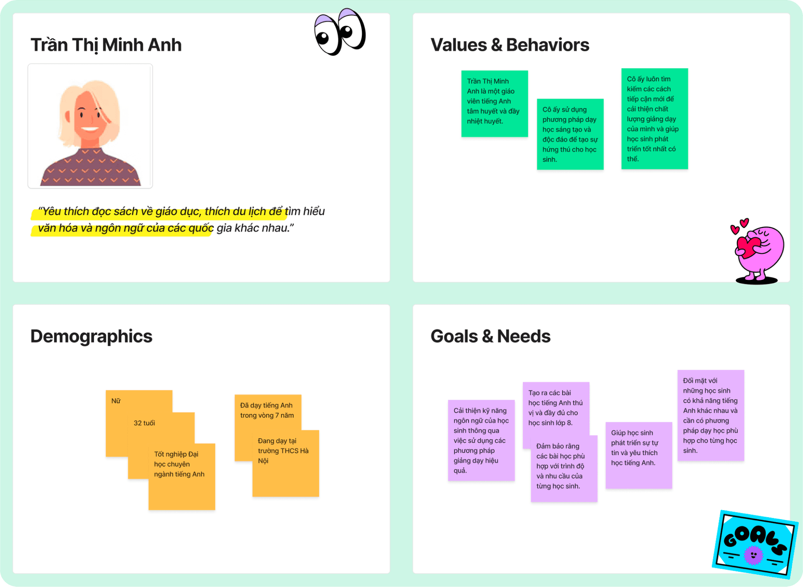
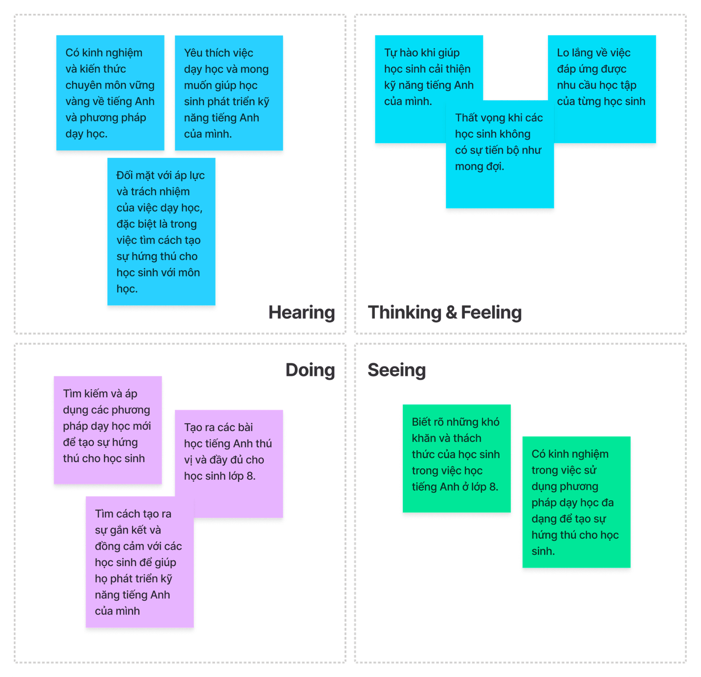
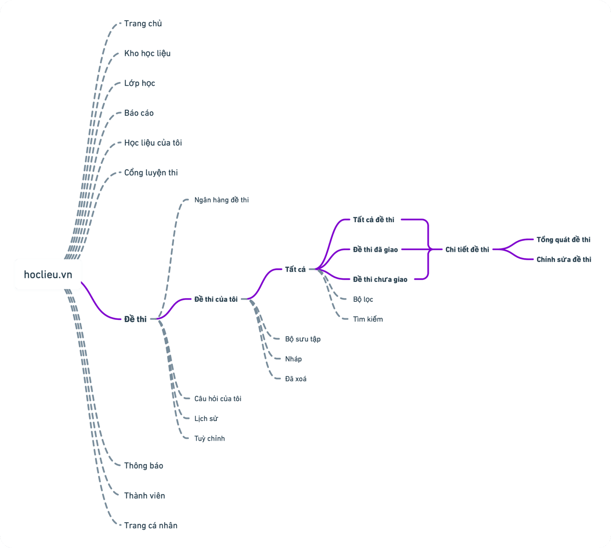
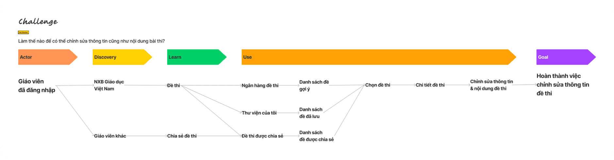
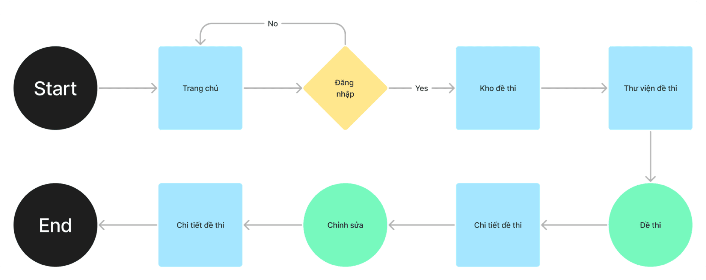
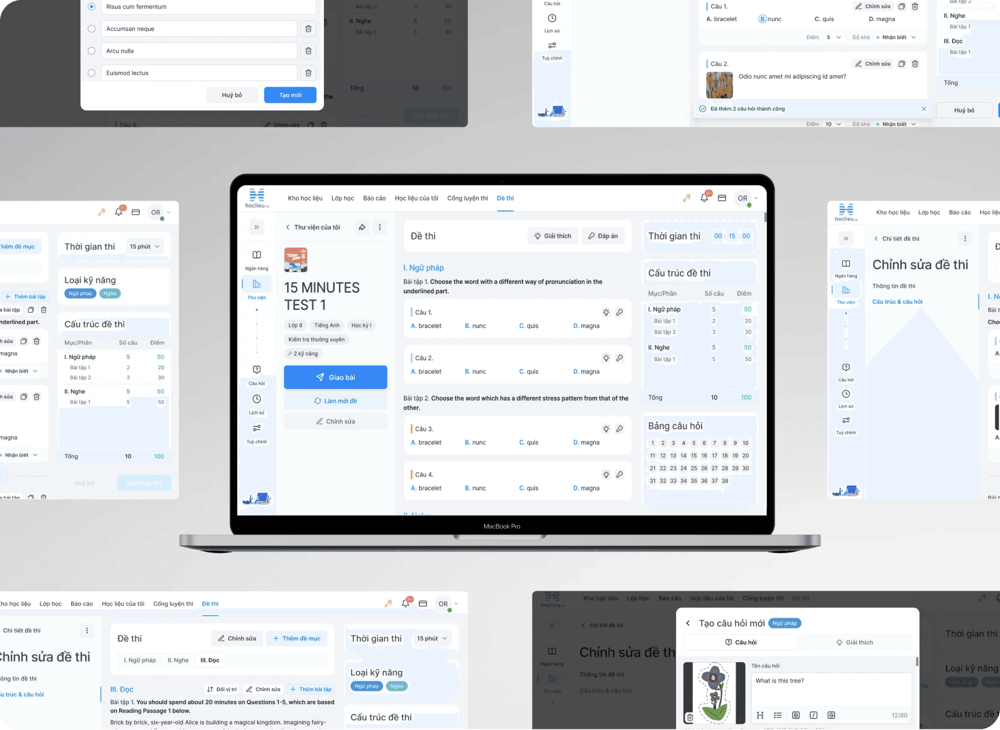
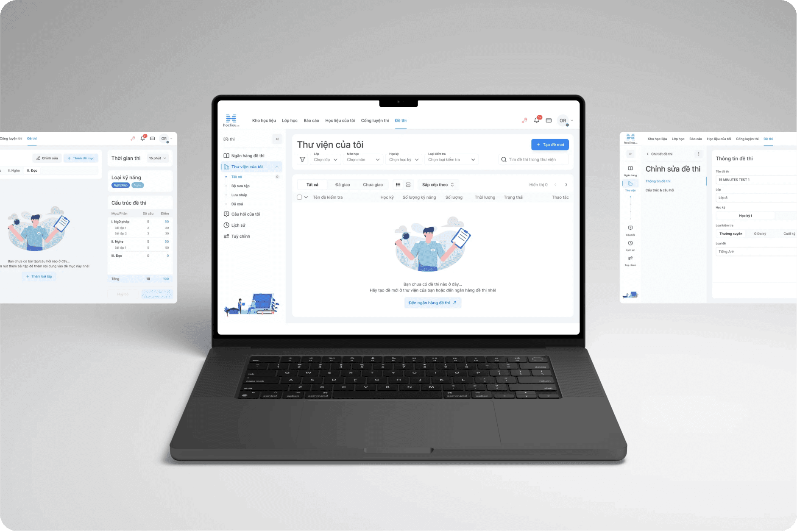
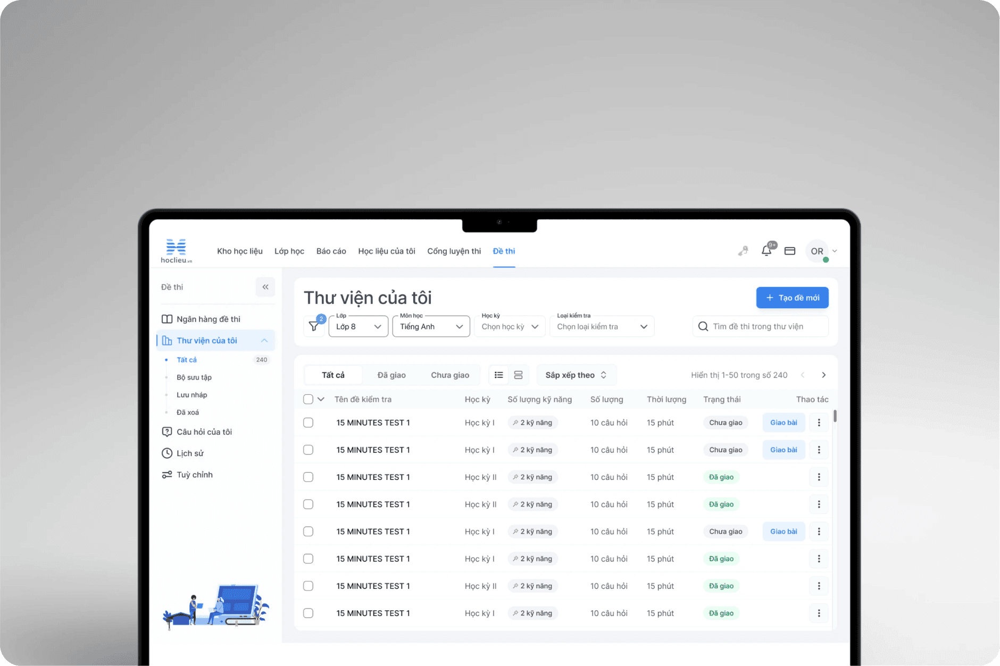

# Hoc Lieu

## Project Overview

**Test Bank (Question Bank)** is a database of sample test questions compiled by the Vietnam Education Publishing House. It helps teachers create test questions quickly, accurately, and in line with the recommended test matrix from the Ministry of Education and Training.

Test Bank allows teachers to view sample questions, edit questions, create new questions, assign questions to classes, download questions to their computers, or share test questions with other users.

## Goal Statement

- **Our** HocLieu (Testbank) **Will let users** to easily edit test information.
- **Which will affect the** ease and speed of test editing.
- **By** giving users with a test content management page.
- **Will measure effectiveness by** reducing the time it takes to edit tests.

## Work Progress

- Challenge project about 1 week to design and solve the problems.
- My position at the project is UXUI designer.

## Design Process

In this project, my team used the **Design Sprint 2.0** approach to solve the UIUX related problems we encountered.

## Proto-Persona

At this phase, we only focus on 1 user group.

## Empathy Mapping

## Conclude: Teacher Minh Anh's Needs

- Minh Anh, a teacher who is passionate about improving students' language skills, wants to provide high-quality assessments to track their progress.
- She often spends a lot of time creating tests and ensuring that the content is aligned with the curriculum and meets the full range of English language skills of 8th grade students.
- She would like to have a website that supports the test creation process by providing pre-existing test templates and allowing her to edit test information to create high-quality assessments.
- She also needs a simple and easy-to-use website to save time and effort in creating high-quality tests.
- Minh Anh would like to be able to preview and download the edited tests to check and ensure that they meet the full range of students' needs and skills.

## User Stories & Acceptance Criteria

Below is a user story about editing exam information, to help teams understand flow.

### Story

- **As a** teacher,
- **I want to be able to** select tests I have previously saved from the test bank.
- **So that** I can edit and use them according to my needs.

### Scenario: Editing test information

- **Given:** I am on the test management page and have selected a test to edit.
- **When:** I click the "Edit" button on the test details page.
- **Then:** I will be taken to the test editing page and can change the test information such as: Test name, Class, Semester, Test type, Skill type, Test time and test content.

## Sitemap

Below is a map list of the pages of a website within a domain.

## Design Sprint

Based on the needs, goals, and user stories shared above, here is a possible user flow and ways for users to achieve the goal of this challenge.

### Map to map

- **Actor(s):** Teacher is logged in.
- **Goal:** Complete editing information & exam content from the exam bank.

### User flow(s)

Building on the user flow above, here are three possible flows for editing the information and content of a quiz based on a pre-existing bank of questions.

Below is an example of a stream.

## Design System

- The design system of project is built based on **Ant Design System** and **Atomic design**.
- We define the brand font and colors first, then we start to separate the element and build the atom of the elements.

Here are a couple of components we defined in the **design system version 1.0.**

## UI Design

- **UI style:** The style of project is based on a **minimalism** and **material design**.

Here are a couple of screens from the project.

