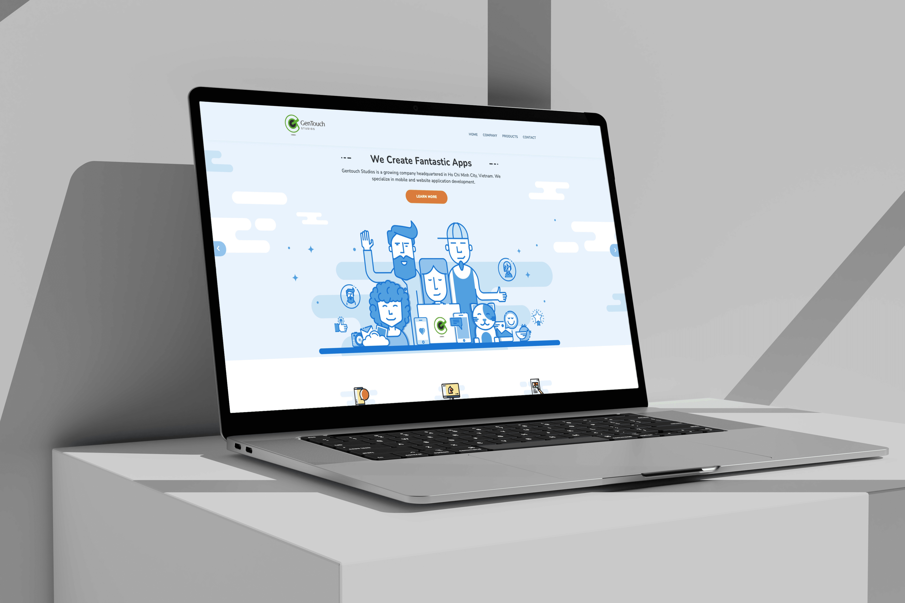
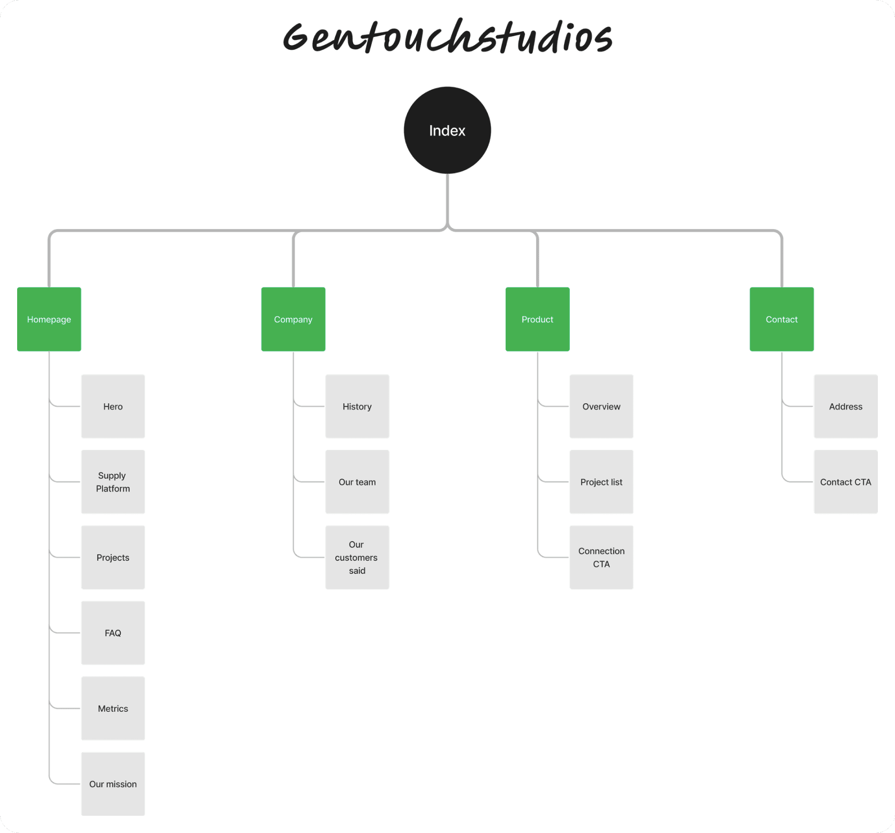
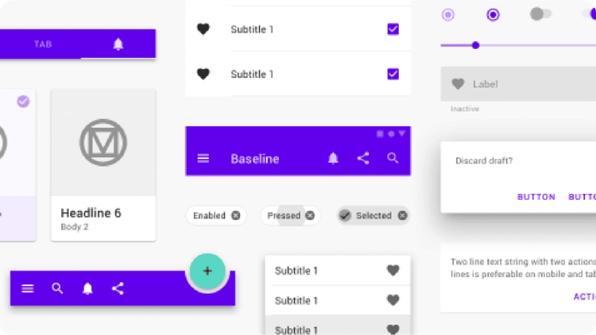
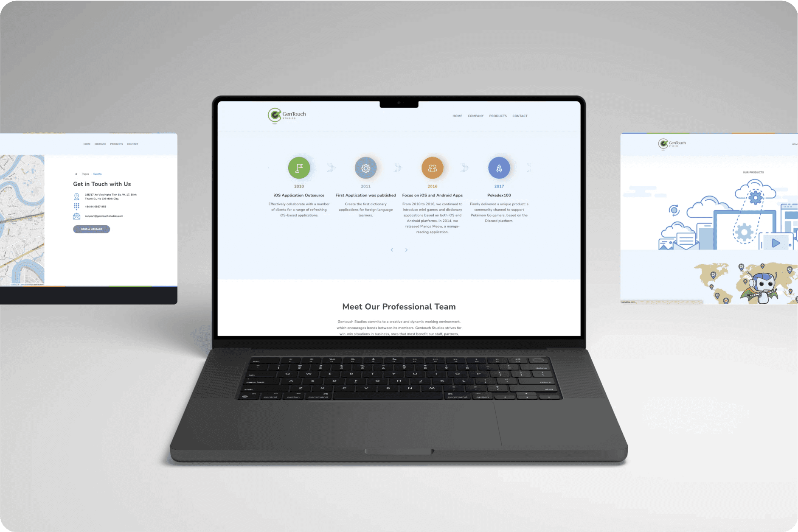
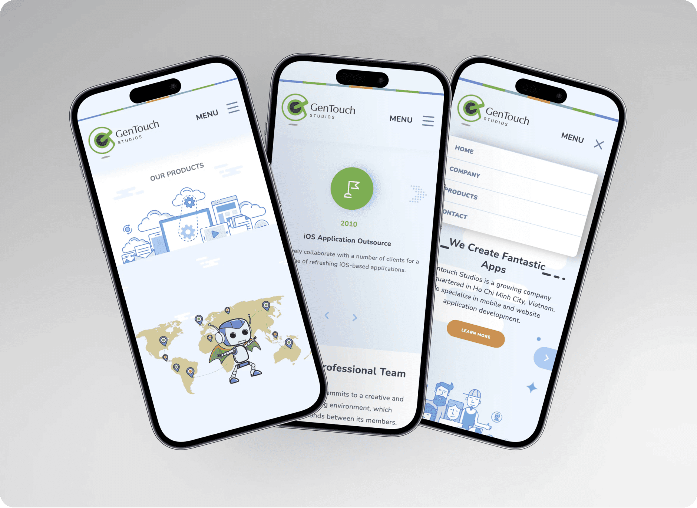
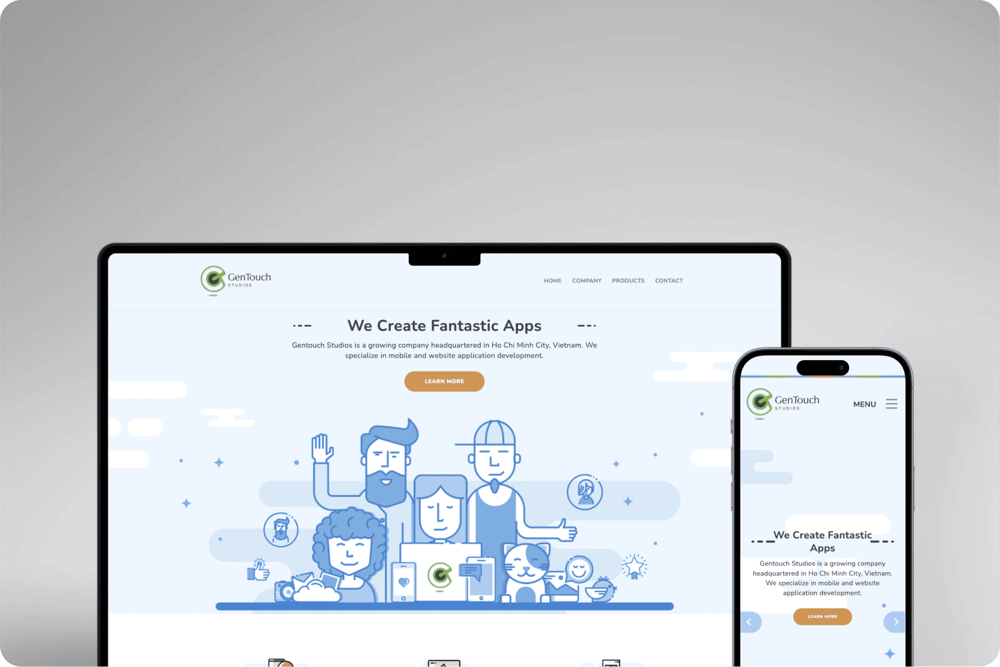

# Tabo ERP - eCommerce

## Project Overview

Gentouchstudios is a company providing Android & IOS application solutions for businesses. They wanted to create a website to showcase their services, projects and team.

## Goal Statement

- **Our** Gentouchstudios **Will let users** to know our services of our company.
- **Which will affect** the connection and contact with our company in the market.
- **By** providing them with our overview, contact and project information.
- **Will measure effectiveness by** user contact & visit times.

## Work Progress

- Short-term project about 1.5 month for UI design.
- My position at the project is UI Designer.
- Design new UI for end-users with new style.

## Design Process

In this project, I received Wireframes and IA from PO and then I started brainstorming ideas about UI & Prototype for their website.

## User Story & Acceptance Criteria

### Story

- **As an** customer.
- **I want** to know the company's services & projects.
- **So that** users can get an overview and services of the company.

### Acceptance criteria

- **Given** company website.
- **When** visit to [www.gentouchstudios.com](http://www.gentouchstudios.com/)
- **Then** user know about Gentouchstudios company.

## Sitemap

Below is a map list of the pages of a website within a domain.

## Design System

In the design system of the project is built based on **Material Design 2.**

## UI Design

- **UI style:** The style of project is based on a **minimalism** and **material design**.

Here are a couple of screens from the e-commerce project.

